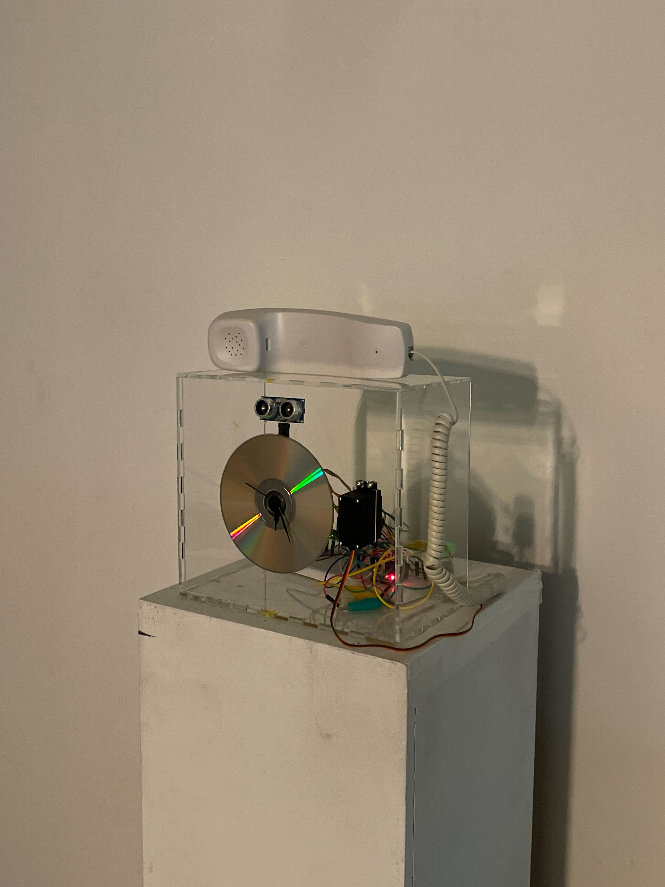

# remember-where-you-came-from
## Introduction
"Remember where you came from." 

 The telephone plays recordings of conversations and laughter shared between my roommates and I, and the clock hands tick back and forth as if time is stuck. You may step closer to try and hear the audio dialogue better, but find that the sound becomes static as you draw near. 
 
 (Our lived experiences cannot be fully captured; memories grow fuzzy over time; the past cannot be revisited or touched.)
 
 The outdated CD and telephone serve as a reminder of how quickly technology changes, in parallel with how quickly we ourselves change as time passes. Old versions discarded and forgotten, in exchange for the new.

https://github.com/user-attachments/assets/e6667c0c-ce21-467b-87bd-ade968f32010

## Implementation
This is an art piece I created for an experimental arts class about sensors and control systems. It was my first time working with arduino and building a physical/electronic object, and I really enjoyed exploring this medium for creative expression. This repo serves as an archive for the project.

All relevant files will be included, including:
- The arduino code.
- SVG file for laser cutting the acrylic box (created with [cuttle.xyz](https://cuttle.xyz/dashboard))
- Arduino circuit diagrams for connecting the speaker, ultrasonic sensor, and servo motor.
- Collaged audio snippets from my life, edited with Audacity.
- Documentation of the project; photos and videos.

Misc. materials
- Telephone (scavenged from my garage and snipped off)
- CD
- Clock mechanism backing + clock hands
- String, to yank 
- Acrylic sheet
